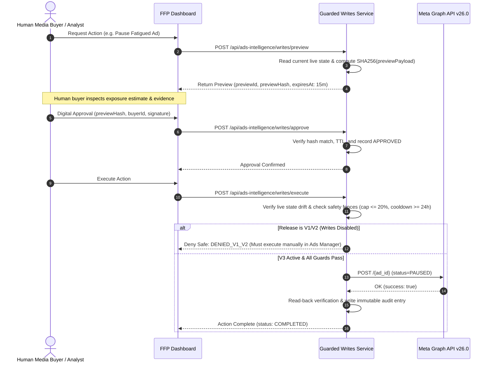

# FFP Ads Intelligence — Guarded Writes Architecture & Safety Policy (V3)

> **Step:** 21 · **Ticket:** FFP-ADS-021  
> **Release Target:** Version 3 (Optional Mutation Layer)  
> **Current Release Policy (V1 & V2):** **STRICT READ-ONLY (All external mutations denied by default)**  
> **Safety Engine:** `gateway/ads-intelligence/guarded-writes.ts`  
> **Verification Test:** `Case 24, 26, 27, 28, 29` in `gateway/__tests__/ads-intelligence-eval.test.ts`

---

## 1. Safety Philosophy & Release Boundaries

Under no circumstances will FFP Ads Intelligence autonomously modify live ad campaigns on Meta without explicit, multi-phase human authorization.

- **V1 & V2 Releases (Current Baseline):**
  - Read-only queries, reconciliation, AI analysis, brief drafting, and experiment logging are enabled.
  - The mutation execution gateway is gated behind `FFP_ADS_EXTERNAL_WRITES_ENABLED=false`.
  - Any invocation of mutating endpoints (`POST /api/ads-intelligence/writes/execute`) fails safe with HTTP 403 / status `DENIED_V1_V2`.
- **V3 Release (Future Phased Rollout):**
  - Only permitted operations: `PAUSE_ENTITY`, `ENABLE_ENTITY`, `UPDATE_BUDGET`.
  - Batch campaign creation, bulk targeting modifications, and bidding strategy changes remain permanently outside scope.

---

## 2. Two-Phase Cryptographic Approval Lifecycle



---

## 3. Strict Backend Safety Fences

The `GuardedWritesService` enforces five mandatory constraints before any mutation payload can be dispatched:

### 1. Maximum Budget Delta Cap (<= 20% / 24h)
- To prevent runaway budget bleed or unexpected platform ad-set learning phase resets, budget updates cannot exceed **20.0%** in either direction within a 24-hour rolling window.
- Formula:
  $$\left|\frac{\text{Proposed Budget} - \text{Current Budget}}{\text{Current Budget}}\right| \le 0.20$$
- Violations immediately transition the preview to `REJECTED` with reason `FENCE_VIOLATION`.

### 2. Mandatory 24-Hour Cooldown
- Once a budget change is executed on a campaign or ad set, subsequent budget modifications on that entity are blocked for **24 hours**.
- This guarantees Meta's delivery algorithms have sufficient stability to re-calibrate without oscillatory feedback loops.

### 3. State-Drift Detection (Optimistic Concurrency Protection)
- Between the moment a preview is generated and the execution request arrives, someone may have manually modified the ad in Meta Ads Manager.
- The service compares live entity status and live budget against `expectedCurrentStatus` and `expectedCurrentBudget`.
- Any mismatch immediately triggers `STATE_DRIFT` rejection, invalidating the approval and requiring a fresh preview.

### 4. Cryptographic Preview Hashing (Tamper Prevention)
- The preview hash is calculated deterministically:
  $$\text{Hash} = \text{SHA256}(\text{storeId} + \text{entityId} + \text{action} + \text{currentStatus} + \text{proposedBudget} + \text{expiresAt})$$
- Approvals must supply the exact matching `previewHash`. Tampered parameters are rejected immediately.

### 5. Emergency Server-Side Kill Switch
- If `process.env.FFP_ADS_EMERGENCY_KILL_SWITCH === "true"`, all executions are instantly halted across all stores regardless of user permissions.
- Write credentials can be revoked independently of the analytics read tokens.

---

## 4. Immutable Audit Trail & Rollback SOP

Every preview, approval, rejection, and execution is recorded in an immutable audit ledger (`GuardedWriteAuditEntry`):

```typescript
export interface GuardedWriteAuditEntry {
  auditId: string;
  previewId: string;
  previewHash: string;
  storeId: string;
  entityId: string;
  action: GuardedWriteAction;
  requestedBy: string;
  approvedBy?: string;
  timestamp: string;
  status: "SUCCESS" | "BLOCKED" | "DENIED_V1_V2" | "STATE_DRIFT" | "FENCE_VIOLATION";
  beforeState: { status: string; budget?: number };
  afterState?: { status: string; budget?: number };
  details: string;
}
```

### Rollback Standard Operating Procedure:
1. Reverting an action is treated as a **new, independent guarded action** requiring a fresh preview and human sign-off.
2. The service does not attempt naive automated reversals, as ad delivery state cannot be unwound retroactively.
3. If an ad was paused in error, the buyer submits an `ENABLE_ENTITY` action subject to standard approval and read-back verification.
